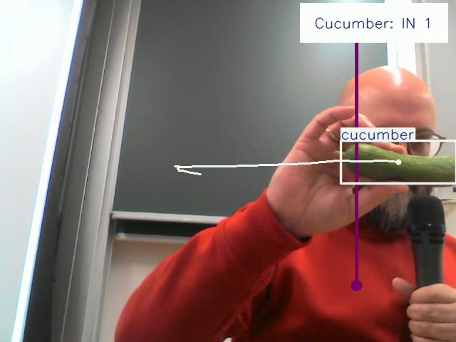

# Cucumber Intelligence

Imagine you're a cucumber farmer: Wouldn't it be nice to know in real time how 
many cucumbers are being harvested on your fields, and how big they are? That's 
what this software is about. 

It was created as my portfolio project within Data Science Retreat[^1], 
Batch 39. If you'd like a quick overview, have a look
at the slides from my final presentation: 

<https://tinyurl.com/CucumberIntelligenceTalk>

(Unfortunately, the video that was taken at the occasion is not available. Rest 
assured that the live demo worked great. :-))

[^1]: <https://datascienceretreat.com/>

## About the project

Commercially, cucumbers (i.e., pickles/gherkins[^2]) 
are harvested manually by farmworkers on a trailer moving slowly across the field. 
The cucumbers are then placed on a conveyor belt for transportation
to a cargo trailer. Monitoring the conveyor belt provides a way to measure the
amount of harvested cucumbers in real time and directly on location.

[^2]: <https://en.wikipedia.org/wiki/Spreewald_gherkins>

This software was built to analyze videos of cucumber transport belts. It uses 
artificial intelligence to recognize cucumbers on the belt, track the individual 
cucumbers through the video, and count them passing through a predefined
position on the belt.

The idea grew out of a publicly funded research project about the usefulness 
of 5G networks and artificial intelligence in agriculture. Unfortunately, the 
original data are private, so I cannot share them here.

## About the software

I took a pretrained YOLOv8 model[^3] and adapted it for cucumber recognition
and tracking. Annotated photographs of cucumbers on transport belts
were available for defining the cucumber image class and further training of the
recognition model.

[^3]: <https://docs.ultralytics.com/de/models/yolov8/>

The training was done in Jupyter notebooks on Google Colab[^4]. 

[^4]: <https://colab.research.google.com/> 

The evaluation of video data was done on my personal computer, a 2012 Lenovo
Thinkpad T430s. :-) I wrote several different Python scripts for data handling 
and inference, all of which can be found in the [src](src) directory. 
Further details about the data, training, inference and 
software workflow are given below:

### Data

As mentioned, the training data are private and cannot be shown. In total, I 
used about 350 photographs of cucumbers on belts, where the boundaries of each 
cucumber had been manually annotated using the program "labelme"[^5]. The 
annotations were then moved to the COCO data format using the program 
"labelme2coco"[^6]. 

[^5]: <https://github.com/wkentaro/labelme>
[^6]: <https://github.com/Tony607/labelme2coco>

Since I wanted to use YOLO for this project, I had to convert the annotations to
the corresponding format. This is done in the "convert..." scripts in the
[src](src) folder. 

Video data were also acquired during the original field campaign. Sample videos
can be found in the corresponding [directory](RawVideos). 

### Training

After saving the annotated training data to my personal Google Drive, I used
Google Colab for the actual fine-tuning. Backup copies of some Jupyter notebooks can
be found in the [Notebooks](Notebooks) folder, the latest was
 [this](Notebooks/Finetuning_YOLO_with_labeltype.ipynb).
(YOLOv8 by Ultralytics uses PyTorch[^7].) 
I defined the cucumber image class to be used, and the training, validation and 
test images were chosen from the annotated photographs 
(see [src/prepare_yolo_data_folders.py](src/prepare_yolo_data_folders.py)).
Thus, I could use pretrained YOLO models from Ultralytics and fine-tune them to the given cucumber data.

[^7]: <https://pytorch.org/>

(Are you *really* interested in the
details of training parameters etc.? Contact me ... and by the way: A very helpful review of different YOLO models can be found here[^8].)

[^8]: <https://arxiv.org/abs/2304.00501>

#### Training results

My (so far) final model-building run comprised 300 training epochs. 
Figures showing metrics like training and validation loss etc. can be found in the [TrainingResults](TrainingResults) directory. The most important training result is of course the 
fine-tuned model, which was automatically saved in each training run. Some model 
files are stored [here](Models). Models for the detection
and classification of cucumbers (which use rectangular bounding boxes around each
object) are produced and used slightly differently from those that include the 
full segmentation, i.e. contour of each individual cucumber. 

### Inference

Having built the fine-tuned models, I used them for inference on video data. There
were two use cases: Pre-recorded conveyor belt videos, and webcam stream data 
for a live demonstration with fresh cucumbers. :-)

I wrote two different Python scripts for these purposes:
[webcam_counting.py](src/webcam_counting.py)
and [segment_tracking_counting.py](src/segment_tracking_counting.py). 
In both cases, the individual cucumbers in the video are 
- detected, 
- classified, 
- segmented (i.e., their contours or bounding boxes are found), 
- tracked, 
- and counted when passing through a predefined line. 

Again, I utilized Ultralytics software in my scripts for these tasks. 
It should be noted that there was an error in their object counting routine 
which I had to circumvent in my local installation[^9], but they appear to have 
fixed it by now[^10].

[^9]: <https://github.com/orgs/ultralytics/discussions/8112?notification_referrer_id=NT_kwDOABvf0rI5NDA2MjcwMDAxOjE4MjY3NzA#discussioncomment-10802832>
[^10]: <https://github.com/ultralytics/ultralytics/pull/17607/files>

(NB: a probably hopelessly inflated pip freeze of my conda environment for 
these scripts can be found at [dsr-setup-requirements.txt](dsr-setup-requirements.txt).)

#### Inference Results

Both cucumber counting scripts produce two different outputs:
- text output to the shell, including details like inference speed and the number
of cucumbers counted; 
- and an output video file, where the individual cucumbers are marked in colour 
and tracked. 

Examples can be found in the [FinalResults](FinalResults) directory. 

